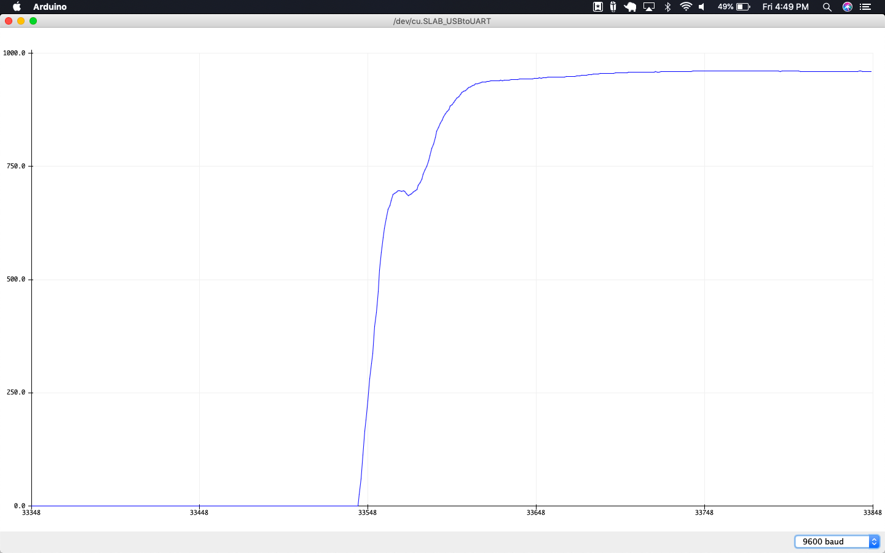

# Data Logger (and using cool sensors!)

*A lab report by Dan Witte.*

## In The Report

Include your responses to the bold questions on your own fork of [this lab report template](https://github.com/FAR-Lab/IDD-Fa18-Lab3). Include snippets of code that explain what you did. Deliverables are due next Tuesday. Post your lab reports as README.md pages on your GitHub, and post a link to that on your main class hub page.

For this lab, we will be experimenting with a variety of sensors, sending the data to the Arduino serial monitor, writing data to the EEPROM of the Arduino, and then playing the data back.

## Part A.  Writing to the Serial Monitor
 
**a. Based on the readings from the serial monitor, what is the range of the analog values being read?**

0-1023

**b. How many bits of resolution does the analog to digital converter (ADC) on the Arduino have?**

1024 = 2^10
There are 10 bits

## Part B. RGB LED

**How might you use this with only the parts in your kit? Show us your solution.**


```
/*
Adafruit Arduino - Lesson 3. RGB LED
*/
 
int redPin = 11;
int greenPin = 10;
int bluePin = 9;
#define ENC_A 6 //these need to be digital input pins
#define ENC_B 7
int index = 0;
//uncomment this line if using a Common Anode LED
//#define COMMON_ANODE
 
void setup()
{
  pinMode(redPin, OUTPUT);
  pinMode(greenPin, OUTPUT);
  pinMode(bluePin, OUTPUT); 
  pinMode(ENC_A, INPUT_PULLUP);
  pinMode(ENC_B, INPUT_PULLUP); 
  Serial.begin (9600);
}
 
void loop()
{
  static unsigned int counter4x = 0;      //the SparkFun encoders jump by 4 states from detent to detent
  static unsigned int counter = 0;
  static unsigned int prevCounter = 0;
  int tmpdata;
  tmpdata = read_encoder();
  if( tmpdata) {
      counter4x += tmpdata;
      counter = counter4x/4;
      if (counter != prevCounter) {
        if (counter % 3 == 0) {
          Serial.println("changing to blue");
          setColor(0, 0, 255);  // blue
          delay(1000);
        }
        if (counter % 3 == 1) {
          Serial.println("changing to green");
          setColor(0, 255, 0);  // blue
          delay(1000);
        }
        if (counter % 3 == 2) {
          Serial.println("changing to red");
          setColor(255, 0, 0);  // blue
          delay(1000);
        }
        prevCounter = counter;
      }
  }
}
 
void setColor(int red, int green, int blue)
{
  #ifdef COMMON_ANODE
    red = 255 - red;
    green = 255 - green;
    blue = 255 - blue;
  #endif
  analogWrite(redPin, red);
  analogWrite(greenPin, green);
  analogWrite(bluePin, blue);  
}

int read_encoder()
{
  static int enc_states[] = {
    0,-1,1,0,1,0,0,-1,-1,0,0,1,0,1,-1,0  };
  static byte ABab = 0;
  ABab *= 4;                   //shift the old values over 2 bits
  ABab = ABab%16;      //keeps only bits 0-3
  ABab += 2*digitalRead(ENC_A)+digitalRead(ENC_B); //adds enc_a and enc_b values to bits 1 and 0
  return ( enc_states[ABab]);
}
```
## Part C. Voltage Varying Sensors 
 
### 1. FSR, Flex Sensor, Photo cell, Softpot

**a. What voltage values do you see from your force sensor?**

When no force is applied, there is 0 voltage displayed on the plotter.
As I apply pressure the voltage will peak out at around 1000 (nearly 5V).


**b. What kind of relationship does the voltage have as a function of the force applied? (e.g., linear?)**

Force logarithmically decreases the resistance. This explains why it is difficult to reach a full 5V measurement when applying force to the resistor. 

**c. Can you change the LED fading code values so that you get the full range of output voltages from the LED when using your FSR?**

Adding the following the following code you can map an analog values over 0 to 255. Any analog read values above 255 will be capped. This will make it easier to hit the full range of output voltages.
```
int ledPin = 7;    // LED connected to digital pin 7
const int sensorPin = A0;    // pin that the sensor is attached to

// variables:
int sensorValue = 0;         // the sensor value
int sensorMin = 1023;        // minimum sensor value
int sensorMax = 0;   

void setup() {
    // read the sensor:
  sensorValue = analogRead(sensorPin);

  // apply the calibration to the sensor reading
  sensorValue = map(sensorValue, sensorMin, sensorMax, 0, 255);

  // in case the sensor value is outside the range seen during calibration
  sensorValue = constrain(sensorValue, 0, 255);

  // fade the LED using the calibrated value:
  analogWrite(ledPin, sensorValue);
}

void loop() {

    // read the sensor:
  sensorValue = analogRead(sensorPin);

  // apply the calibration to the sensor reading
  sensorValue = map(sensorValue, sensorMin, sensorMax, 0, 255);

  // in case the sensor value is outside the range seen during calibration
  sensorValue = constrain(sensorValue, 0, 255);


  // fade in from min to max in increments of 5 points:
  for (int fadeValue = 0 ; fadeValue <= sensorValue; fadeValue += 5) {
    // sets the value (range from 0 to 255):
      analogWrite(ledPin, sensorValue);
    // wait for 30 milliseconds to see the dimming effect
    delay(30);
  }

  // fade out from max to min in increments of 5 points:
  for (int fadeValue = sensorValue ; fadeValue >= 0; fadeValue -= 5) {
    // sets the value (range from 0 to 255):
    analogWrite(ledPin, fadeValue);
    // wait for 30 milliseconds to see the dimming effect
    delay(30);
  }
}
  void loop() {
  // read the sensor:
  sensorValue = analogRead(sensorPin);

  // apply the calibration to the sensor reading
  sensorValue = map(sensorValue, sensorMin, sensorMax, 0, 255);

  // in case the sensor value is outside the range seen during calibration
  sensorValue = constrain(sensorValue, 0, 255);

  // fade the LED using the calibrated value:
  analogWrite(ledPin, sensorValue);
}
```

**d. What resistance do you need to have in series to get a reasonable range of voltages from each sensor?**

For the photosensitive resistor, a 10k resistor works. This achieves a range of voltages between ~200-1000. This was tested by covering the photosensitive cell vs shining a flash light directly on it. At lower resistances the voltages were much lower.

For the softpot a 10k resistor on the 5V side and a 10k resistor on the ground side are required. This results in an output range of ~250-1000 that changes linearly.

**e. What kind of relationship does the resistance have as a function of stimulus? (e.g., linear?)**

The relationship is logarithmic for the FSP and photosensitive resistor. As a stimulus increases, resistance changes in an increasingly less responsive manner. The relationship can be seen in the graph below from the adafruit website.


For the softpot and the flex sensor, the relationship between resistance and stimulus is linear. On the soft pot as you depress the wiper in different locations and on the flex sensor when you bend it additional degrees, the resistance adjusts at a constant rate.

### 2. Accelerometer
 
**a. Include your accelerometer read-out code in your write-up.**

[Video](https://photos.app.goo.gl/xQASYmzAduK9FBqF7)

```
// Basic demo for accelerometer readings from Adafruit LIS3DH

#include <Wire.h>
#include <SPI.h>
#include <Adafruit_LIS3DH.h>
//#include <Adafruit_Sensor.h>

// Used for software SPI
#define LIS3DH_CLK 13
#define LIS3DH_MISO 12
#define LIS3DH_MOSI 11
// Used for hardware & software SPI
#define LIS3DH_CS 10

// I2C
Adafruit_LIS3DH lis = Adafruit_LIS3DH();

// include the library code:
#include <LiquidCrystal.h>

// initialize the library by associating any needed LCD interface pin
// with the arduino pin number it is connected to
const int rs = 12, en = 11, d4 = 5, d5 = 4, d6 = 3, d7 = 2;
LiquidCrystal lcd(rs, en, d4, d5, d6, d7);

// rgb pins
int redPin = 8;
int greenPin = 9;
int bluePin = 10;


// track accelerations
float lastZ = 0;
float lastX = 0;
float lastY = 0;

void setup(void) {
#ifndef ESP8266
  while (!Serial);     // will pause Zero, Leonardo, etc until serial console opens
#endif

  Serial.begin(9600);
  Serial.println("LIS3DH test!");
  
  if (! lis.begin(0x18)) {   // change this to 0x19 for alternative i2c address
    Serial.println("Couldnt start");
    while (1);
  }
  Serial.println("LIS3DH found!");
  
  lis.setRange(LIS3DH_RANGE_4_G);   // 2, 4, 8 or 16 G!

    pinMode(redPin, OUTPUT);
  pinMode(greenPin, OUTPUT);
  pinMode(bluePin, OUTPUT);  
  lcd.begin(16, 2);
}

void loop() {

  lis.read();      // get X Y and Z data at once
  /* Or....get a new sensor event, normalized */ 
  sensors_event_t event; 
  lis.getEvent(&event);


  float diffZ = abs(event.acceleration.z - lastZ);
  float diffY = abs(event.acceleration.y - lastY);
  float diffX = abs(event.acceleration.x - lastX);
  if (diffZ > diffY && diffZ > diffX) {
    setColor(0, 255, 0); 
  }
  else if (diffY > diffZ && diffY > diffX) {
    setColor(255, 0, 0);  
  }
  else if (diffX > diffZ && diffX > diffY) {
    setColor(0, 0, 255);  
  }
  else {
    setColor(255, 255, 255); 
  }
  lastZ = event.acceleration.z;
  lastY = event.acceleration.y;
  lastX = event.acceleration.x;
  
  
  /* Display the results (acceleration is measured in m/s^2) */
  lcd.setCursor(0,0);
  lcd.print("X:"); lcd.print(diffX);
  lcd.setCursor(8,0);
  lcd.print("Y:"); lcd.print(diffY); 
  lcd.setCursor(0, 1);
  lcd.print("Z:"); lcd.print(diffZ); 
  lcd.println(" m/s^2 ");
  Serial.println("accelerating in Z" + String(event.acceleration.z));
  Serial.println("accelerating in Y" + String(event.acceleration.y));
  Serial.println("accelerating in x" + String(event.acceleration.x));
 
  delay(1000); 
}

void setColor(int red, int green, int blue)
{
  #ifdef COMMON_ANODE
    red = 255 - red;
    green = 255 - green;
    blue = 255 - blue;
  #endif
  analogWrite(redPin, red);
  analogWrite(greenPin, green);
  analogWrite(bluePin, blue);  
}
```


## Optional. Graphic Display

**Take a picture of your screen working insert it here!**

[Graphic Display Video](https://photos.app.goo.gl/n7xU8uERtzfADfBZ6)

```

#include <SPI.h>
#include <Wire.h>
#include <Adafruit_GFX.h>
#include <Adafruit_SSD1306.h>

#define SCREEN_WIDTH 128 // OLED display width, in pixels
#define SCREEN_HEIGHT 32 // OLED display height, in pixels

// Declaration for an SSD1306 display connected to I2C (SDA, SCL pins)
#define OLED_RESET     4 // Reset pin # (or -1 if sharing Arduino reset pin)
Adafruit_SSD1306 display(SCREEN_WIDTH, SCREEN_HEIGHT, &Wire, OLED_RESET);


void setup() {
  Serial.begin(9600);

  // SSD1306_SWITCHCAPVCC = generate display voltage from 3.3V internally
  if(!display.begin(SSD1306_SWITCHCAPVCC, 0x3C)) { // Address 0x3C for 128x32
    Serial.println(F("SSD1306 allocation failed"));
    for(;;); // Don't proceed, loop forever
  }


  // Clear the buffer
  display.clearDisplay();
  display.setTextSize(2);             // Normal 1:1 pixel scale
  display.setTextColor(WHITE);        // Draw white text
  display.setCursor(1,0);             // Start at top-left corner
}

void loop() {
  display.clearDisplay();
  display.setCursor(1,0); 
  display.print("A0: " + String(analogRead(A0)));
  display.display();
  Serial.println(analogRead(A0));
  delay(300);
}
```

## Part D. Logging values to the EEPROM and reading them back
 
### 1. Reading and writing values to the Arduino EEPROM

**a. Does it matter what actions are assigned to which state? Why?**

In this case, no. As long as you have finite controle over the voltage, you can determine which state the machine is in. However if there were a default voltage, e.g. using something like a FSP where the default voltage is very low, it may matter. If the action associated with low voltage was "clear EEPROM", then you may accidentally be deleting data as soon as the circuit is live.

**b. Why is the code here all in the setup() functions and not in the loop() functions?**

The compiler will fail if you have more than 1 loop function for a program. This is because Arduino is single threaded, also this likely avoids race conditions that may occur.

**c. How many byte-sized data samples can you store on the Atmega328?**

According to wikipedia the Atmega328 has 1KB EEPROM, so that would be 1024 byte sized data samples.

**d. How would you get analog data from the Arduino analog pins to be byte-sized? How about analog data from the I2C devices?**

Since analogRead values are limited to 0-1023, we know it's max size is 10 bits. To convert analog data you could divide by 4 and drop the decimal, reducing the number of bits required to represent the number by 2. You would then have to multiply by 4 at the time of reading the data. This would result in slight loss of fidelity of the data, as you've compressed the information.

For I2C the data is stored in 7bits, however the 8th bigt indicates whether it is read/write data, with the other bits shifted right. Therefore you can just ignore the first bit of a byte.

**e. Alternately, how would we store the data if it were bigger than a byte? (hint: take a look at the [EEPROMPut](https://www.arduino.cc/en/Reference/EEPROMPut) example)**

Using EEPROM.put() and EEPROM.get() you can assign memory addresses for information and the Arduino will auotmatically calculate how many bytes are needed using eeeprom.put. You can then access those values through eeprom.get by passing in the start of the memory address for that information. If storing more info it helps to add the size of the stored object to your eeaddress variable to keep track of what eeprom is unused.

**Upload your modified code that takes in analog values from your sensors and prints them back out to the Arduino Serial Monitor.**

To print store & print values to/from eeprom, I added the following code to the loop:
```
EEPROM.put(eeAdd, analogRead(sensorPin));
  Serial.println(EEPROM.get(eeAdd, x));
  // map the pot range to number of states :
```

### 2. Design your logger
 
**a. Insert here a copy of your final state diagram.**

!(State Diagram)[eeprom_state_diagram.png]

### 3. Create your data logger!
 
**a. Record and upload a short demo video of your logger in action.**

```
// Basic demo for accelerometer readings from Adafruit LIS3DH

#include <Wire.h>
#include <SPI.h>
#include <Adafruit_LIS3DH.h>
//#include <Adafruit_Sensor.h>
#include <SPI.h>
#include <Wire.h>
#include <Adafruit_GFX.h>
#include <Adafruit_SSD1306.h>
#include <EEPROM.h>

// Used for software SPI
#define LIS3DH_CLK 13
#define LIS3DH_MISO 12
#define LIS3DH_MOSI 11
// Used for hardware & software SPI
#define LIS3DH_CS 10

// I2C
Adafruit_LIS3DH lis = Adafruit_LIS3DH();

// screen setup
#include <SPI.h>
#include <Wire.h>
#include <Adafruit_GFX.h>
#include <Adafruit_SSD1306.h>
//Wire.beginOnPins(A2, A1);

#define SCREEN_WIDTH 128 // OLED display width, in pixels
#define SCREEN_HEIGHT 32 // OLED display height, in pixels

// Declaration for an SSD1306 display connected to I2C (SDA, SCL pins)
#define OLED_RESET     4 // Reset pin # (or -1 if sharing Arduino reset pin)
Adafruit_SSD1306 display(SCREEN_WIDTH, SCREEN_HEIGHT, &Wire, OLED_RESET);

int readIndex = 0;
int writeIndex = 0;
int eeAddresses [100];

// track accelerations
float lastZ = 0;
float lastX = 0;
float lastY = 0;
int lastRecorded;
int lastRead;
String state;

struct accelData {
  char axis;
  float accel;
};

void setup(void) {
  //   clear eeprom
  for (int i = 0 ; i < EEPROM.length() ; i++) {
    EEPROM.write(i, 0);
  }

  state = "record";
  lastRecorded = millis();
  lastRead = millis();
#ifndef ESP8266
  while (!Serial);     // will pause Zero, Leonardo, etc until serial console opens
#endif

  Serial.begin(9600);
  Serial.println("LIS3DH test!");

  if (! lis.begin(0x18)) {   // change this to 0x19 for alternative i2c address
    Serial.println("Couldnt start");
    while (1);
  }
  Serial.println("LIS3DH found!");
  // SSD1306_SWITCHCAPVCC = generate display voltage from 3.3V internally
  if (!display.begin(SSD1306_SWITCHCAPVCC, 0x3C)) { // Address 0x3C for 128x32
    Serial.println(F("SSD1306 allocation failed"));
    for (;;); // Don't proceed, loop forever
  }

  // Clear the buffer
  display.clearDisplay();
  display.setTextSize(2);             // Normal 1:1 pixel scale
  display.setTextColor(WHITE);        // Draw white text
  display.setCursor(1, 0);            // Start at top-left corner
  display.print("Starting to read");
  display.display();
  delay(1000);
}

void loop() {
  if (analogRead(A0) > 500) {
    if (state == "record") {
      state = "read";
    }
    else if (state == "read") {
      state = "record";
    }
    display.clearDisplay();
    display.setCursor(1, 0);
    display.print("State: \n" + state);
    display.display();
    delay(1000);
  }

  if (state == "record" && millis() - lastRecorded > 1000) {
    accelData data;
    lis.read();      // get X Y and Z data at once
    /* Or....get a new sensor event, normalized */
    sensors_event_t event;
    lis.getEvent(&event);
    float diffZ = abs(event.acceleration.z - lastZ);
    float diffY = abs(event.acceleration.y - lastY);
    float diffX = abs(event.acceleration.x - lastX);

    display.clearDisplay();
    display.setCursor(1, 0);
    display.display();

    if (diffZ > diffX & diffZ > diffY) {
      data = {char("Z"), diffZ};
      display.print("Z: " + String(diffZ));
      display.display();
    }

    if (diffY > diffX & diffY > diffZ) {
      data = {char("Y"), diffY};
      display.print("Y: " + String(diffY));
      display.display();
    }
    if (diffX > diffZ & diffX > diffY) {
      accelData data = {char("X"), diffX};
      display.print("X: " + String(diffX));
      display.display();
    }
    lastZ = event.acceleration.z;
    lastY = event.acceleration.y;
    lastX = event.acceleration.x;
    lastRecorded = millis();

    if (writeIndex == 0) {
      eeAddresses[writeIndex] = 0;
    }
//    else {
//      accelData test;
//      EEPROM.get(eeAddresses[0], test);
//      delay(100);
//      Serial.println("eeadd[0] is " + String(eeAddresses[0]));
//      Serial.println("eedata " + String(test.axis) + " " + String(test.accel));
//    }
    EEPROM.put(eeAddresses[writeIndex], data);
    writeIndex++;
    readIndex = writeIndex;
    eeAddresses[writeIndex] = eeAddresses[writeIndex - 1] + sizeof(data);
    Serial.println("eeaddress " + String(eeAddresses[writeIndex]));;
  }

  if (state == "read" && millis() - lastRead > 1000) {
    accelData data;
    if (readIndex > 1) {
      EEPROM.get(eeAddresses[readIndex - 1], data);
      display.clearDisplay();
      display.setCursor(1, 0);
      display.print(String(data.axis) + ": " + String(data.accel));
      display.display();
      lastRead = millis();
      Serial.println("reading data: " + String(data.accel));
      readIndex--;
    }
    else {
      display.clearDisplay();
      display.setCursor(1, 0);
      display.print("At end of memory");
      display.display();
    }
  }
  Serial.println("Read address: " + String(eeAddresses[readIndex]));
  Serial.println(" & Write address: " + String(eeAddresses[writeIndex]));
}
```
